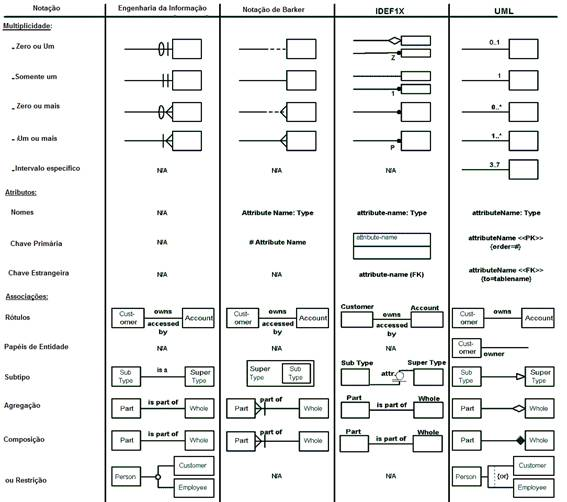

## Modelagem de Bancos de Dados

### Links importantes
- https://www.devmedia.com.br/modelagem-de-dados-tutorial/20398
- https://www.devmedia.com.br/modelagem-de-dados-conceitual-construindo-pontes-entre-dados-e-negocios/30597#:~:text=Em%20resumo%2C%20modelos%20de%20dados,exemplo%2C%20um%20sistema%20de%20informa%C3%A7%C3%B5es.

### Tópicos
- Modelagem tem seus modelos para a criar o Banco de Dados, e são eles os
  - Modelagem Conceitual: Se trata do modelo mais basico aonde as entidades são tratadas da maneira mais abstraída, temos como função mostrar como é feita a interessão de ações inteiras dentro do banco. Alguns arquitetos constroem junto diagramas com os "objetos" (ORM - Object-Role Model) relacionados de exemplo na modelagem conceitual não criando posteriormente a modelagem lógica.
  - Modelagem Lógica: Nela já temos mais dados como os atributos de cada coluna e nesse nível já sabemos as direções das ligações que cada entidade vai ter uma com a outra, ainda sem as informações de programa.
  - Modelagem Física: É quando começamos a saber os nomes reais de cada atributo e cada entidade, aonde aplicamos as tabelas de ligação e todos os atributos ID aparecem, 

